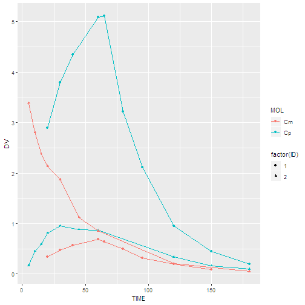
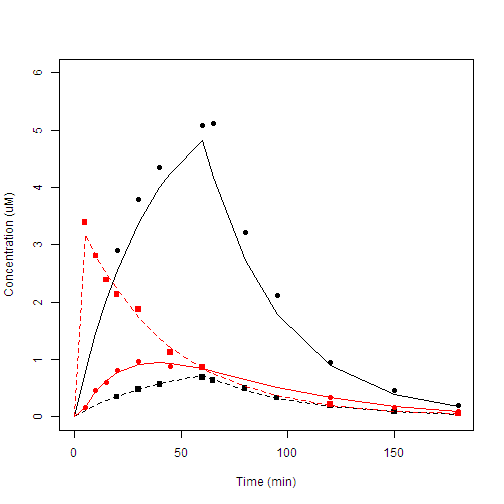

# Reversible Metabolism

[](assets/logo.jpg)

# Abstract

**Keywords**  
Reversible metabolism, cisplatin, monohydrate, multiple compartment

# Introduction

The aim of this exercise is to demonstrate how to implement a system of differential equations describing reversible metabolism. 
Data were taken from thε li〔eraturε on cisplatin kinetics (Andersson (1995]) and used [ O generate synthetic concentr따ion-time values for cisplatin p and its monohydrate m. 
This information was then used to obtain initial parameter estimates for a model of reversible metabolism. 
This exercise demonstrates how to implement the equations for this model into a program. 
In an infusion solution of cisplatin, equilibrium is established berween cisplatin and its monohydratε complex. 
Thus, the input rate can be split into cisplatin infusion ratε Iη and monohydra[ e infusion rate In,,
We have also chosen to describe thε εquilibrium process in vivo berween cisplatin and its monohydrate complex by means of rwo clearance rates.

# Materials and Methods

Objectives {@andersson1995stability}

- To implement a set of differential equations mimicking reversible metabolism
- To estimate the disposition and interconversion parameters of the two compounds

Pharmacokinetic and Pharmacodynamic Data Analysis PK34


Clpd and Cl,,,d. The exper
that takes account of such a split inf] ut rate and clearance are shown in 「
Figure 34.1. See also Section 2.4.
638

6 Input, lnputm
5
/.
등 4
3-
C
];I 2
Eliminat,。n Eliminati 。n
ct, Cl.,
0
0 20 40 60 80 100 120 140 160 180
Time (min)
The equation for C뼈latin (p) is
dC
V - --ι= J.η - Cl · C - Cl J • C + Cl , · C dt p p P a P “ (341)
Where VP' CP' Iη/μ Clp and Clpd are the volume, concentration, input rate,
clearance and interthe
concentration of [ he monohydratε. The conversion of cisplatin to the
monohydrate occurs with a rate constant derived according to Equation
34:2
k12,pd = Cl pd . VP (34:2)
The reversal rate for conversion of the monohydrate to cisplatin is
k21 씨 = Cl111d · κ” (34 3)
The equation for the monohydr따E (m) is
dC
V· -」뜨 = In111 -Cl111 · C” - Cl111r1 · C'" + Clpc1 · Cp (34:4)
dt

# Results

Where κ,,, ζ’” Iη”” C/111 and Cl111d arε the volume, ζoncentration, input rate,
clearance and inter-conversion clearancε of the monohydrate respectively.
ζ” is the concentration of the monohydrate.
Pharmac。kinetic Applications
Figure 34.1 Left: Obse「ved
(symb이s) and predicted (s이 id
lines) concentration time data of
cisplatin and its monohydrate
The symbols correspond to
cisplatin (upper curve) and the
monohyd「ate (bottom curve) after
infusion of cisplatin which also
contains the monol1ydrate, and
cisplalin (second f「om bottom)
and monohyd「ate (second from
top) after monohydrate infusion‘
Right: A two compaπment model
mimicking reversible metabolism
was used to model the data‘
639


·‘ E」-- ·• ‘•·"'￥‘;-. -’--· ' - }T ~
Pharmac。kinetic and Pharmacodynamic Data Analys is ‘ ;」
Parameter
κ(니
Clm (L·min·')
ι,(μg·L· ')
GIP (L· min-1)
k12(min-1)
k21 (min-1)
WRSS
640
Initial parameter estimates
Procedures involved in obtaining initial parameter estimates, AUC, MRT,
and so on for a system of revεrsible processes are covered in depth in Ebling
and Jusko [1986] . The initial parameter estimates selected diffcεred a little
from the values used to gener따C the data.
Interpretation of results and conclusions
The observed and model-predicted plasma concentrations, and the final
parameter estimates are shown in Figure 34.1 and Table 34. 1, respectively.
WRSS in Table 34.1 denotes the weighted residual sum of squares.
Table 34.1 Paramete「estimates of the micro-constant and interconversion clearance models
Microconstant model Interconversion clearance model
Estimate CV% Parameter Estimate CV%
14.1 3 κ(니 14.1 3
0.0085 22 C/m (L·min-1) 0.0084 22
2.96 2 Vm (μg·L-1) 2.97 2
0.446 2 GIP (L·min 1) 0.445 2
0.00021 34 Clpd (min-1) 0.0031 33
0.021 3 C/md (min-1) 0.063 5
0.0089 WRSS 0.0089


# Discussion


```r
# setup ----

library(deSolve)
library(wnl)
library(ggplot2)
library(dplyr)
library(readr)
library(purrr)

round_df <- function(x, digits) {
    # round all numeric variables
    # x: data frame 
    # digits: number of digits to round
    numeric_columns <- sapply(x, mode) == 'numeric'
    x[numeric_columns] <-  round(x[numeric_columns], digits)
    x
}

raw_dPK34 <- read_csv('data-raw/PK34.csv', skip = 1) %>% # Unit: min   NA    umol/L    NA
  set_names(c("TIME", "MOL", "DV", "ID")) %>% 
  print()
```

```
## Warning: Missing column names filled in: 'X2' [2], 'X4' [4]
```

```
## Parsed with column specification:
## cols(
##   min = col_double(),
##   X2 = col_character(),
##   `umol/L` = col_double(),
##   X4 = col_double()
## )
```

```
## # A tibble: 38 x 4
##     TIME MOL      DV    ID
##    <dbl> <chr> <dbl> <dbl>
##  1    20 Cp    2.90      1
##  2    30 Cp    3.80      1
##  3    40 Cp    4.35      1
##  4    60 Cp    5.08      1
##  5    65 Cp    5.11      1
##  6    80 Cp    3.22      1
##  7    95 Cp    2.11      1
##  8   120 Cp    0.950     1
##  9   150 Cp    0.453     1
## 10   180 Cp    0.200     1
## # ... with 28 more rows
```

```r
# REQUIREMENT: dPK34

dPK34 <- raw_dPK34 %>% 
  as.data.frame() %>% 
  print()
```

```
##    TIME MOL     DV ID
## 1    20  Cp 2.8980  1
## 2    30  Cp 3.7958  1
## 3    40  Cp 4.3491  1
## 4    60  Cp 5.0832  1
## 5    65  Cp 5.1105  1
## 6    80  Cp 3.2216  1
## 7    95  Cp 2.1134  1
## 8   120  Cp 0.9499  1
## 9   150  Cp 0.4529  1
## 10  180  Cp 0.1996  1
## 11   20  Cm 0.3432  1
## 12   30  Cm 0.4787  1
## 13   40  Cm 0.5655  1
## 14   60  Cm 0.6874  1
## 15   65  Cm 0.6351  1
## 16   80  Cm 0.4933  1
## 17   95  Cm 0.3230  1
## 18  120  Cm 0.1947  1
## 19  150  Cm 0.0873  1
## 20    5  Cp 0.1678  2
## 21   10  Cp 0.4507  2
## 22   15  Cp 0.5905  2
## 23   20  Cp 0.8120  2
## 24   30  Cp 0.9562  2
## 25   45  Cp 0.8809  2
## 26   60  Cp 0.8715  2
## 27  120  Cp 0.3371  2
## 28  150  Cp 0.1646  2
## 29  180  Cp 0.0965  2
## 30    5  Cm 3.3911  2
## 31   10  Cm 2.8098  2
## 32   15  Cm 2.3812  2
## 33   20  Cm 2.1331  2
## 34   30  Cm 1.8709  2
## 35   45  Cm 1.1224  2
## 36   60  Cm 0.8564  2
## 37  120  Cm 0.2119  2
## 38  180  Cm 0.0507  2
```

```r
ggplot(data = raw_dPK34, aes(x = TIME, y = DV, group = interaction(ID, MOL), color = MOL, shape = factor(ID))) +
  geom_line() +
  geom_point()
```



```r
# main ----
 
S1 = cbind(TIME=c(0, 60), RATE1=c(2.375,0), RATE2=c(0.065, 0))
S2 = cbind(TIME=c(0,5), RATE1=c(0, 0), RATE2=c(2, 0))
InfHist = list(S1, S2) ; InfHist
```

```
## [[1]]
##      TIME RATE1 RATE2
## [1,]    0 2.375 0.065
## [2,]   60 0.000 0.000
## 
## [[2]]
##      TIME RATE1 RATE2
## [1,]    0     0     2
## [2,]    5     0     0
```

```r
PKde = function(t, y, p)
{
  cInf = InfHist[[cID]]
  Rate1 = cInf[findInterval(t, cInf[,"TIME"]),"RATE1"]
  Rate2 = cInf[findInterval(t, cInf[,"TIME"]),"RATE2"]

  Ke1 = p["CLp"]/p["Vc"]
  Ke2 = p["CLm"]/p["Vm"]
  
  K12 = p["CLd1"]/p["Vc"]
  K21 = p["CLd2"]/p["Vm"]
  
  dy1dt = Rate1/p["Vc"] - Ke1*y[1] - K12*y[1] + K21*y[2]
  dy2dt = Rate2/p["Vm"] - Ke2*y[2] + K12*y[1] - K21*y[2]

  return(list(c(dy1dt, dy2dt)))  
}

# TIME = sort(unique(c(0, dPK34[,"TIME"]))) ; TIME

TIME <- dPK34 %>% 
  select(TIME) %>% 
  distinct %>% 
  arrange(TIME) %>% 
  .$TIME %>% 
  c(0, .)

iTime1 = TIME %in% dPK34[dPK34$ID==1 & dPK34$MOL == "Cp", "TIME"] ; iTime1 ; TIME[iTime1]
```

```
##  [1] FALSE FALSE FALSE FALSE  TRUE  TRUE  TRUE FALSE  TRUE  TRUE  TRUE
## [12]  TRUE  TRUE  TRUE  TRUE
```

```
##  [1]  20  30  40  60  65  80  95 120 150 180
```

```r
iTime2 = TIME %in% dPK34[dPK34$ID==1 & dPK34$MOL == "Cm", "TIME"] ; iTime2 ; TIME[iTime2]
```

```
##  [1] FALSE FALSE FALSE FALSE  TRUE  TRUE  TRUE FALSE  TRUE  TRUE  TRUE
## [12]  TRUE  TRUE  TRUE FALSE
```

```
## [1]  20  30  40  60  65  80  95 120 150
```

```r
iTime3 = TIME %in% dPK34[dPK34$ID==2 & dPK34$MOL == "Cp", "TIME"] ; iTime3 ; TIME[iTime3]
```

```
##  [1] FALSE  TRUE  TRUE  TRUE  TRUE  TRUE FALSE  TRUE  TRUE FALSE FALSE
## [12] FALSE  TRUE  TRUE  TRUE
```

```
##  [1]   5  10  15  20  30  45  60 120 150 180
```

```r
iTime4 = TIME %in% dPK34[dPK34$ID==2 & dPK34$MOL == "Cm", "TIME"] ; iTime4 ; TIME[iTime4]
```

```
##  [1] FALSE  TRUE  TRUE  TRUE  TRUE  TRUE FALSE  TRUE  TRUE FALSE FALSE
## [12] FALSE  TRUE FALSE  TRUE
```

```
## [1]   5  10  15  20  30  45  60 120 180
```

```r
## Figure 34.1, p 639
plot(0, 0, type="n", xlim=c(0, 180), ylim=c(0, 6), xlab="Time (min)", ylab="Concentration (uM)")

IDs = unique(dPK34[,"ID"])
nID = length(IDs)

y = vector()
for (i in 1:nID) {
  cID <<- IDs[i] # referencing wihtin PKde
  cy = lsoda(y=c(0, 0), times=TIME, func=PKde, parms=c(Vc=14.1169, Vm=2.96671, CLp=0.445693, CLm=0.00833429, CLd1=0.00308422, CLd2=0.0632217))
  iTime1 = TIME %in% dPK34[dPK34$ID==cID & dPK34$MOL == "Cp", "TIME"]
  iTime2 = TIME %in% dPK34[dPK34$ID==cID & dPK34$MOL == "Cm", "TIME"]
  points(dPK34[dPK34$ID==cID & dPK34$MOL == "Cp", "TIME"], dPK34[dPK34$ID==cID & dPK34$MOL == "Cp", "DV"], pch=19, col=i)
  points(dPK34[dPK34$ID==cID & dPK34$MOL == "Cm", "TIME"], dPK34[dPK34$ID==cID & dPK34$MOL == "Cm", "DV"], pch=15, col=i)
  lines(TIME, cy[,"1"], col=i)
  lines(TIME, cy[,"2"], lty=2, col=i)
  y = c(y, cy[iTime1,"1"], cy[iTime2,"2"])
} ; y
```



```
##  [1] 2.55552376 3.37761139 3.99610671 4.81441001 4.17378776 2.72732733
##  [7] 1.78989627 0.89572921 0.39647380 0.17838586 0.35283682 0.47772517
## [13] 0.57722944 0.71947375 0.64234466 0.45657052 0.32400849 0.18240085
## [19] 0.09118321 0.16369918 0.43388961 0.63098688 0.76954597 0.91680743
## [25] 0.93544164 0.83643957 0.33047538 0.18391146 0.09863677 3.17547144
## [31] 2.81502383 2.49576460 2.21294735 1.74035083 1.21461251 0.84833055
## [37] 0.20307299 0.04893432
```

```r
# REQUIREMENT: fPK34

fPK34 = function(THETA)
{
  Vc   = THETA[1]
  Vm   = THETA[2]
  CLp  = THETA[3]
  CLm  = THETA[4]
  CLd1 = THETA[5]
  CLd2 = THETA[6]
  
  y = vector()
  for (i in 1:nID) {
    cID <<- IDs[i] # referencing wihtin PKde
    cy = lsoda(y=c(0, 0), times=TIME, func=PKde, parms=c(Vc=Vc, Vm=Vm, CLp=CLp, CLm=CLm, CLd1=CLd1, CLd2=CLd2))
    iTime1 = TIME %in% dPK34[dPK34$ID==cID & dPK34$MOL == "Cp", "TIME"]
    iTime2 = TIME %in% dPK34[dPK34$ID==cID & dPK34$MOL == "Cm", "TIME"]
    y = c(y, cy[iTime1,"1"], cy[iTime2,"2"])
  }
  return(y)
}

fPK34(c(14.1169, 2.96671, 0.445693, 0.00833429, 0.00308422, 0.0632217))
```

```
##  [1] 2.55552376 3.37761139 3.99610671 4.81441001 4.17378776 2.72732733
##  [7] 1.78989627 0.89572921 0.39647380 0.17838586 0.35283682 0.47772517
## [13] 0.57722944 0.71947375 0.64234466 0.45657052 0.32400849 0.18240085
## [19] 0.09118321 0.16369918 0.43388961 0.63098688 0.76954597 0.91680743
## [25] 0.93544164 0.83643957 0.33047538 0.18391146 0.09863677 3.17547144
## [31] 2.81502383 2.49576460 2.21294735 1.74035083 1.21461251 0.84833055
## [37] 0.20307299 0.04893432
```

```r
nlr(fPK34, 
    dPK34, 
    pNames=c("Vc", "Vm", "CLp", "CLm", "CLd1", "CLd2"), 
    IE=c(15, 3, 0.5, 0.01, 0.003, 0.1), 
    Error="P")  # different result
```

```
## $Est
##             Vc         Vm         CLp          CLm         CLd1
## PE  12.2632223 2.96922318 0.387163717  0.008286228 2.769220e-03
## SE   0.2976141 0.06429357 0.007053857  0.002297237 9.378015e-04
## RSE  2.4268835 2.16533300 1.821931206 27.723550725 3.386518e+01
##            CLd2   PropErrVar    PropErrSD
## PE  0.063359711 2.358498e-03  0.048564370
## SE  0.003403815 5.451718e-04  0.005612879
## RSE 5.372207654 2.311521e+01 11.557605967
## 
## $Cov
##                       Vc            Vm           CLp           CLm
## Vc          8.857416e-02 -4.059350e-03  1.763707e-03  2.384853e-04
## Vm         -4.059350e-03  4.133663e-03  1.205204e-05 -1.215658e-04
## CLp         1.763707e-03  1.205204e-05  4.975689e-05 -4.102777e-07
## CLm         2.384853e-04 -1.215658e-04 -4.102777e-07  5.277296e-06
## CLd1       -1.234065e-06  3.361468e-05  9.578955e-07 -9.934532e-07
## CLd2       -2.907455e-04  2.006395e-04  8.793774e-07 -7.453596e-06
## PropErrVar  3.195370e-06  1.607169e-06  1.295802e-07 -2.241168e-08
##                     CLd1          CLd2    PropErrVar
## Vc         -1.234065e-06 -2.907455e-04  3.195370e-06
## Vm          3.361468e-05  2.006395e-04  1.607169e-06
## CLp         9.578955e-07  8.793774e-07  1.295802e-07
## CLm        -9.934532e-07 -7.453596e-06 -2.241168e-08
## CLd1        8.794717e-07  1.985034e-06  1.541532e-08
## CLd2        1.985034e-06  1.158596e-05  6.205444e-08
## PropErrVar  1.541532e-08  6.205444e-08  2.972123e-07
## 
## $run
## $run$m
## [1] 18
## 
## $run$n
## [1] 20
## 
## $run$run
## [1] 20
## 
## $run$p.value
## [1] 0.5601923
## 
## 
## $`Objective Function Value`
## [1] -214.8824
## 
## $`-2LL`
## [1] -145.043
## 
## $AIC
## [1] -131.043
## 
## $AICc
## [1] -127.3097
## 
## $BIC
## [1] -119.5799
## 
## $Convergence
## NULL
## 
## $Message
## [1] "ERROR: ABNORMAL_TERMINATION_IN_LNSRCH"
## 
## $Prediction
##  [1] 2.93187136 3.86940128 4.57202567 5.49646370 4.75593120 3.08966796
##  [7] 2.01582126 0.99900153 0.43718887 0.19461925 0.35348392 0.47910933
## [13] 0.57942649 0.72324174 0.64647820 0.46099030 0.32805038 0.18537752
## [19] 0.09299729 0.16377446 0.43407283 0.63122795 0.76981032 0.91705571
## [25] 0.93560330 0.83651042 0.33042301 0.18387134 0.09861319 3.17269773
## [31] 2.81243675 2.49336725 2.21073794 1.73849985 1.21323133 0.84732569
## [37] 0.20283544 0.04888868
## 
## $Residual
##  [1] -0.0338713646 -0.0736012783 -0.2229256654 -0.4132637050  0.3545687963
##  [6]  0.1319320405  0.0975787355 -0.0491015264  0.0157111320  0.0049807500
## [11] -0.0102839209 -0.0004093298 -0.0139264874 -0.0358417357 -0.0113781976
## [16]  0.0323097019 -0.0050503797  0.0093224784 -0.0056972890  0.0040255415
## [21]  0.0166271687 -0.0407279536  0.0421896838  0.0391442919 -0.0547033032
## [26]  0.0349895756  0.0066769878 -0.0192713404 -0.0021131933  0.2184022677
## [31] -0.0026367526 -0.1121672536 -0.0776379380  0.1324001526 -0.0908313258
## [36]  0.0090743104  0.0090645616  0.0018113181
## 
## $`Elapsed Time`
## Time difference of 21.49923 secs
```

```r
# Vc  12.3 vs 14.1 (R vs WinNonlin, NONMEM)
# AIC -131.0377 vs -131.05554 (R vs WinNonlin)
e$r # -214.8824 vs -214.895 (R vs NONMEM)
```

```
## $par
## [1] -0.10144821  0.08968804 -0.15576057 -0.08799020  0.01995352 -0.35634204
## [7] -3.64714529
## 
## $value
## [1] -214.8824
## 
## $counts
## function gradient 
##      114      114 
## 
## $convergence
## [1] 52
## 
## $message
## [1] "ERROR: ABNORMAL_TERMINATION_IN_LNSRCH"
```

# Acknowledgement

Edison Ack

# Appendix

## NONMEM control stream 


```r
$PROB GABRIELSSON PK34
$INPUT ID TIME AMT RATE CMT DV MDV
$DATA ../PK34NM.csv IGNORE=@
$SUBR ADVAN13 TOL6
$MODEL
  COMP (PARENT)
  COMP (METABOLITE)
$PK
  Vc   = THETA(1)*EXP(ETA(1))
  Vm   = THETA(2)
  CLp  = THETA(3)
  CLm  = THETA(4)
  CLd1 = THETA(5)
  CLd2 = THETA(6)
  S1   = Vc
  S2   = Vm

$DES
  Ke1 = CLp/Vc
  Ke2 = CLm/Vm
  K12 = CLd1/Vc
  K21 = CLd2/Vm
  
  DADT(1) = -Ke1*A(1) - K12*A(1) + K21*A(2)*Vc/Vm 
  DADT(2) = -Ke2*A(2) + K12*A(1)*Vm/Vc - K21*A(2)

$ERROR
  Y    = F + F*ERR(1)

$THETA
  (0, 15)
  (0, 3)
  (0, 0.5)
  (0, 0.01)
  (0, 0.003)
  (0, 0.3)

$OMEGA 0 FIX
$SIGMA 0.1
$EST MAX=9999
$COV UNCOND PRINT=ERS
```

## NONMEM output


```r
NONLINEAR MIXED EFFECTS MODEL PROGRAM (NONMEM) VERSION 7.4.1
ORIGINALLY DEVELOPED BY STUART BEAL, LEWIS SHEINER, AND ALISON BOECKMANN
CURRENT DEVELOPERS ARE ROBERT BAUER, ICON DEVELOPMENT SOLUTIONS,
AND ALISON BOECKMANN. IMPLEMENTATION, EFFICIENCY, AND STANDARDIZATION
PERFORMED BY NOUS INFOSYSTEMS.

PROBLEM NO.:         1
GABRIELSSON PK34

DATA CHECKOUT RUN:              NO
DATA SET LOCATED ON UNIT NO.:    2
THIS UNIT TO BE REWOUND:        NO
NO. OF DATA RECS IN DATA SET:       41
NO. OF DATA ITEMS IN DATA SET:   8
ID DATA ITEM IS DATA ITEM NO.:   1
DEP VARIABLE IS DATA ITEM NO.:   6
MDV DATA ITEM IS DATA ITEM NO.:  7

INDICES PASSED TO SUBROUTINE PRED:
  8   2   3   4   0   0   5   0   0   0   0

LABELS FOR DATA ITEMS:
ID TIME AMT RATE CMT DV MDV EVID

FORMAT FOR DATA:
(7E7.0,1F2.0)

TOT. NO. OF OBS RECS:       38
TOT. NO. OF INDIVIDUALS:        2

LENGTH OF THETA:   6

DEFAULT THETA BOUNDARY TEST OMITTED:    NO

OMEGA HAS SIMPLE DIAGONAL FORM WITH DIMENSION:   1

DEFAULT OMEGA BOUNDARY TEST OMITTED:    NO

SIGMA HAS SIMPLE DIAGONAL FORM WITH DIMENSION:   1

DEFAULT SIGMA BOUNDARY TEST OMITTED:    NO

INITIAL ESTIMATE OF THETA:
LOWER BOUND    INITIAL EST    UPPER BOUND
 0.0000E+00     0.1500E+02     0.1000E+07
 0.0000E+00     0.3000E+01     0.1000E+07
 0.0000E+00     0.5000E+00     0.1000E+07
 0.0000E+00     0.1000E-01     0.1000E+07
 0.0000E+00     0.3000E-02     0.1000E+07
 0.0000E+00     0.3000E+00     0.1000E+07

INITIAL ESTIMATE OF OMEGA:
0.0000E+00

OMEGA CONSTRAINED TO BE THIS INITIAL ESTIMATE

INITIAL ESTIMATE OF SIGMA:
0.1000E+00

COVARIANCE STEP OMITTED:        NO
R MATRIX PRINTED:              YES
S MATRIX PRINTED:              YES
EIGENVLS. PRINTED:             YES
SPECIAL COMPUTATION:            NO
COMPRESSED FORMAT:              NO
GRADIENT METHOD USED:     NOSLOW
SIGDIGITS ETAHAT (SIGLO):                  -1
SIGDIGITS GRADIENTS (SIGL):                -1
EXCLUDE COV FOR FOCE (NOFCOV):              NO
TURN OFF Cholesky Transposition of R Matrix (CHOLROFF): NO
KNUTHSUMOFF:                                -1
RESUME COV ANALYSIS (RESUME):               NO
SIR SAMPLE SIZE (SIRSAMPLE):              -1
NON-LINEARLY TRANSFORM THETAS DURING COV (THBND): 1
PRECONDTIONING CYCLES (PRECOND):        0
PRECONDTIONING TYPES (PRECONDS):        TOS
FORCED PRECONDTIONING CYCLES (PFCOND):0
PRECONDTIONING TYPE (PRETYPE):        0
FORCED POS. DEFINITE SETTING: (FPOSDEF):0

WARNING: THE NUMBER OF PARAMETERS TO BE ESTIMATED
EXCEEDS THE NUMBER OF INDIVIDUALS WITH DATA.
DOUBLE PRECISION PREDPP VERSION 7.4.1

GENERAL NONLINEAR KINETICS MODEL WITH STIFF/NONSTIFF EQUATIONS (LSODA, ADVAN13)

MODEL SUBROUTINE USER-SUPPLIED - ID NO. 9999

MAXIMUM NO. OF BASIC PK PARAMETERS:   6

COMPARTMENT ATTRIBUTES
COMPT. NO.   FUNCTION                         INITIAL    ON/OFF      DOSE      DEFAULT    DEFAULT
                                              STATUS     ALLOWED    ALLOWED    FOR DOSE   FOR OBS.
   1         PARENT                             ON         YES        YES        YES        YES
   2         METABOLITE                         ON         YES        YES        NO         NO
   3         OUTPUT                             OFF        YES        NO         NO         NO
INITIAL (BASE) TOLERANCE SETTINGS:
NRD (RELATIVE) VALUE(S) OF TOLERANCE:   6
ANRD (ABSOLUTE) VALUE(S) OF TOLERANCE:  12

ADDITIONAL PK PARAMETERS - ASSIGNMENT OF ROWS IN GG
COMPT. NO.                             INDICES
             SCALE      BIOAVAIL.   ZERO-ORDER  ZERO-ORDER  ABSORB
                        FRACTION    RATE        DURATION    LAG
   1            7           *           *           *           *
   2            8           *           *           *           *
   3            *           -           -           -           -
            - PARAMETER IS NOT ALLOWED FOR THIS MODEL
            * PARAMETER IS NOT SUPPLIED BY PK SUBROUTINE;
              WILL DEFAULT TO ONE IF APPLICABLE

ERROR IN LOG Y IS MODELED

DATA ITEM INDICES USED BY PRED ARE:
  EVENT ID DATA ITEM IS DATA ITEM NO.:      8
  TIME DATA ITEM IS DATA ITEM NO.:          2
  DOSE AMOUNT DATA ITEM IS DATA ITEM NO.:   3
  DOSE RATE DATA ITEM IS DATA ITEM NO.:     4
  COMPT. NO. DATA ITEM IS DATA ITEM NO.:    5


PK SUBROUTINE CALLED WITH EVERY EVENT RECORD.
PK SUBROUTINE NOT CALLED AT NONEVENT (ADDITIONAL OR LAGGED) DOSE TIMES.

DURING SIMULATION, ERROR SUBROUTINE CALLED WITH EVERY EVENT RECORD.
OTHERWISE, ERROR SUBROUTINE CALLED ONCE IN THIS PROBLEM.

DES SUBROUTINE USES COMPACT STORAGE MODE.


#TBLN:      1
#METH: First Order

ESTIMATION STEP OMITTED:                 NO
ANALYSIS TYPE:                           POPULATION
NUMBER OF SADDLE POINT RESET ITERATIONS:      0
GRADIENT METHOD USED:               NOSLOW
EPS-ETA INTERACTION:                     NO
NO. OF FUNCT. EVALS. ALLOWED:            9999
NO. OF SIG. FIGURES REQUIRED:            3
INTERMEDIATE PRINTOUT:                   YES
ESTIMATE OUTPUT TO MSF:                  NO
IND. OBJ. FUNC. VALUES SORTED:           NO
NUMERICAL DERIVATIVE
      FILE REQUEST (NUMDER):               NONE
MAP (ETAHAT) ESTIMATION METHOD (OPTMAP):   0
ETA HESSIAN EVALUATION METHOD (ETADER):    0
INITIAL ETA FOR MAP ESTIMATION (MCETA):    0
SIGDIGITS FOR MAP ESTIMATION (SIGLO):      100
GRADIENT SIGDIGITS OF
      FIXED EFFECTS PARAMETERS (SIGL):     100
NOPRIOR SETTING (NOPRIOR):                 OFF
NOCOV SETTING (NOCOV):                     OFF
DERCONT SETTING (DERCONT):                 OFF
FINAL ETA RE-EVALUATION (FNLETA):          ON
EXCLUDE NON-INFLUENTIAL (NON-INFL.) ETAS
      IN SHRINKAGE (ETASTYPE):             NO
NON-INFL. ETA CORRECTION (NONINFETA):      OFF
RAW OUTPUT FILE (FILE): PK34.ext
EXCLUDE TITLE (NOTITLE):                   NO
EXCLUDE COLUMN LABELS (NOLABEL):           NO
FORMAT FOR ADDITIONAL FILES (FORMAT):      S1PE12.5
PARAMETER ORDER FOR OUTPUTS (ORDER):       TSOL
WISHART PRIOR DF INTERPRETATION (WISHTYPE):0
KNUTHSUMOFF:                               0
INCLUDE LNTWOPI:                           NO
INCLUDE CONSTANT TERM TO PRIOR (PRIORC):   NO
INCLUDE CONSTANT TERM TO OMEGA (ETA) (OLNTWOPI):NO
ADDITIONAL CONVERGENCE TEST (CTYPE=4)?:    NO
EM OR BAYESIAN METHOD USED:                 NONE

TOLERANCES FOR ESTIMATION/EVALUATION STEP:
NRD (RELATIVE) VALUE(S) OF TOLERANCE:   6
ANRD (ABSOLUTE) VALUE(S) OF TOLERANCE:  12
TOLERANCES FOR COVARIANCE STEP:
NRD (RELATIVE) VALUE(S) OF TOLERANCE:   6
ANRD (ABSOLUTE) VALUE(S) OF TOLERANCE:  12

THE FOLLOWING LABELS ARE EQUIVALENT
PRED=NPRED
RES=NRES
WRES=NWRES
IWRS=NIWRES
IPRD=NIPRED
IRS=NIRES

MONITORING OF SEARCH:


ITERATION NO.:    0    OBJECTIVE VALUE:   24295395.2609277        NO. OF FUNC. EVALS.:   8
CUMULATIVE NO. OF FUNC. EVALS.:        8
NPARAMETR:  1.5000E+01  3.0000E+00  5.0000E-01  1.0000E-02  3.0000E-03  3.0000E-01  1.0000E-01
PARAMETER:  1.0000E-01  1.0000E-01  1.0000E-01  1.0000E-01  1.0000E-01  1.0000E-01  1.0000E-01
GRADIENT:  -1.6717E+08 -5.4465E+07  2.1578E+08  4.9026E+06 -4.8134E+07  9.7933E+07 -4.8586E+07


ITERATION NO.:   39    OBJECTIVE VALUE:  -214.894944711757        NO. OF FUNC. EVALS.: 414
CUMULATIVE NO. OF FUNC. EVALS.:      422
NPARAMETR:  1.4118E+01  2.9669E+00  4.4572E-01  8.3276E-03  3.0861E-03  6.3233E-02  2.3467E-03
PARAMETER:  3.9363E-02  8.8922E-02 -1.4925E-02 -8.3110E-02  1.2829E-01 -1.4569E+00 -1.7761E+00
GRADIENT:   6.1245E-02  5.4563E-02 -6.6534E-02 -2.9759E-02  1.1708E-03 -9.9369E-02  8.2812E-03

#TERM:

MINIMIZATION SUCCESSFUL
HOWEVER, PROBLEMS OCCURRED WITH THE MINIMIZATION.
REGARD THE RESULTS OF THE ESTIMATION STEP CAREFULLY, AND ACCEPT THEM ONLY
AFTER CHECKING THAT THE COVARIANCE STEP PRODUCES REASONABLE OUTPUT.
NO. OF FUNCTION EVALUATIONS USED:      422
NO. OF SIG. DIGITS IN FINAL EST.:  3.4

TOTAL DATA POINTS NORMALLY DISTRIBUTED (N):           38
N*LOG(2PI) CONSTANT TO OBJECTIVE FUNCTION:    69.839328523555125
OBJECTIVE FUNCTION VALUE WITHOUT CONSTANT:   -214.89494471175738
OBJECTIVE FUNCTION VALUE WITH CONSTANT:      -145.05561618820224
REPORTED OBJECTIVE FUNCTION DOES NOT CONTAIN CONSTANT

TOTAL EFFECTIVE ETAS (NIND*NETA):                             0

#TERE:
Elapsed estimation  time in seconds:     0.09

S MATRIX ALGORITHMICALLY SINGULAR

INVERSE COVARIANCE MATRIX SET TO RS*RMAT, WHERE S* IS A PSEUDO INVERSE OF S
Elapsed covariance  time in seconds:     0.02
Elapsed postprocess time in seconds:     0.00


************************************************************************************************************************
********************                                                                                ********************
********************                                   FIRST ORDER                                  ********************
#OBJT:**************                       MINIMUM VALUE OF OBJECTIVE FUNCTION                      ********************
********************                                                                                ********************
************************************************************************************************************************


#OBJV:********************************************     -214.895       **************************************************

************************************************************************************************************************
********************                                                                                ********************
********************                                   FIRST ORDER                                  ********************
********************                             FINAL PARAMETER ESTIMATE                           ********************
********************                                                                                ********************
************************************************************************************************************************


THETA - VECTOR OF FIXED EFFECTS PARAMETERS   *********

        TH 1      TH 2      TH 3      TH 4      TH 5      TH 6

        1.41E+01  2.97E+00  4.46E-01  8.33E-03  3.09E-03  6.32E-02


OMEGA - COV MATRIX FOR RANDOM EFFECTS - ETAS  ********

        ETA1

ETA1    0.00E+00


SIGMA - COV MATRIX FOR RANDOM EFFECTS - EPSILONS  ****

        EPS1

EPS1    2.35E-03


OMEGA - CORR MATRIX FOR RANDOM EFFECTS - ETAS  *******

        ETA1

ETA1    0.00E+00


SIGMA - CORR MATRIX FOR RANDOM EFFECTS - EPSILONS  ***

        EPS1

EPS1    4.84E-02


************************************************************************************************************************
********************                                                                                ********************
********************                                   FIRST ORDER                                  ********************
********************                            STANDARD ERROR OF ESTIMATE                          ********************
********************                                                                                ********************
************************************************************************************************************************


THETA - VECTOR OF FIXED EFFECTS PARAMETERS   *********

        TH 1      TH 2      TH 3      TH 4      TH 5      TH 6

        2.50E-01  1.34E-02  2.03E-03  3.80E-04  7.34E-05  3.17E-05


OMEGA - COV MATRIX FOR RANDOM EFFECTS - ETAS  ********

        ETA1

ETA1   .........


SIGMA - COV MATRIX FOR RANDOM EFFECTS - EPSILONS  ****

        EPS1

EPS1    2.26E-04


OMEGA - CORR MATRIX FOR RANDOM EFFECTS - ETAS  *******

        ETA1

ETA1   .........


SIGMA - CORR MATRIX FOR RANDOM EFFECTS - EPSILONS  ***

        EPS1

EPS1    2.33E-03


************************************************************************************************************************
********************                                                                                ********************
********************                                   FIRST ORDER                                  ********************
********************                          COVARIANCE MATRIX OF ESTIMATE                         ********************
********************                                                                                ********************
************************************************************************************************************************

           TH 1      TH 2      TH 3      TH 4      TH 5      TH 6      OM11      SG11

TH 1    6.26E-02

TH 2    3.36E-03  1.80E-04

TH 3    5.07E-04  2.72E-05  4.10E-06

TH 4    9.50E-05  5.10E-06  7.69E-07  1.44E-07

TH 5    1.84E-05  9.85E-07  1.49E-07  2.79E-08  5.38E-09

TH 6    7.93E-06  4.25E-07  6.42E-08  1.20E-08  2.32E-09  1.01E-09

OM11   ......... ......... ......... ......... ......... ......... .........

SG11   -5.66E-05 -3.03E-06 -4.58E-07 -8.58E-08 -1.66E-08 -7.16E-09 .........  5.11E-08


************************************************************************************************************************
********************                                                                                ********************
********************                                   FIRST ORDER                                  ********************
********************                          CORRELATION MATRIX OF ESTIMATE                        ********************
********************                                                                                ********************
************************************************************************************************************************

           TH 1      TH 2      TH 3      TH 4      TH 5      TH 6      OM11      SG11

TH 1    2.50E-01

TH 2    1.00E+00  1.34E-02

TH 3    1.00E+00  1.00E+00  2.03E-03

TH 4    1.00E+00  1.00E+00  1.00E+00  3.80E-04

TH 5    1.00E+00  1.00E+00  1.00E+00  1.00E+00  7.34E-05

TH 6    9.99E-01  9.99E-01  9.99E-01  9.98E-01  9.98E-01  3.17E-05

OM11   ......... ......... ......... ......... ......... ......... .........

SG11   -1.00E+00 -1.00E+00 -1.00E+00 -1.00E+00 -1.00E+00 -9.99E-01 .........  2.26E-04


************************************************************************************************************************
********************                                                                                ********************
********************                                   FIRST ORDER                                  ********************
********************                      INVERSE COVARIANCE MATRIX OF ESTIMATE                     ********************
********************                                                                                ********************
************************************************************************************************************************

           TH 1      TH 2      TH 3      TH 4      TH 5      TH 6      OM11      SG11

TH 1    2.60E+00

TH 2    6.64E+01  1.70E+03

TH 3   -1.31E+02 -3.35E+03  6.61E+03

TH 4   -5.05E+03 -1.29E+05  2.55E+05  9.81E+06

TH 5    3.40E+03  8.68E+04 -1.71E+05 -6.60E+06  4.44E+06

TH 6   -4.94E+03 -1.26E+05  2.49E+05  9.60E+06 -6.46E+06  9.39E+06

OM11   ......... ......... ......... ......... ......... ......... .........

SG11    4.71E+03  1.20E+05 -2.37E+05 -9.15E+06  6.15E+06 -8.95E+06 .........  8.53E+06


************************************************************************************************************************
********************                                                                                ********************
********************                                   FIRST ORDER                                  ********************
********************                      EIGENVALUES OF COR MATRIX OF ESTIMATE                     ********************
********************                                                                                ********************
************************************************************************************************************************

            1         2         3         4         5         6         7

       -1.91E-16  2.25E-15 -3.56E-15  1.05E-14 -1.51E-14  2.54E-03  7.00E+00


************************************************************************************************************************
********************                                                                                ********************
********************                                   FIRST ORDER                                  ********************
********************                                     R MATRIX                                   ********************
********************                                                                                ********************
************************************************************************************************************************

           TH 1      TH 2      TH 3      TH 4      TH 5      TH 6      OM11      SG11

TH 1    6.09E+01

TH 2   -4.10E+01  2.17E+03

TH 3   -2.19E+03  1.31E+03  9.44E+04

TH 4   -6.57E+03 -4.78E+04  2.53E+05  5.04E+06

TH 5    7.35E+02  2.58E+04 -5.77E+04 -2.30E+06  2.47E+06

TH 6   -1.69E+03 -7.40E+04  8.00E+04  4.20E+06 -2.26E+06  4.47E+06

OM11   ......... ......... ......... ......... ......... ......... .........

SG11    3.93E+02 -1.45E+03 -2.19E+04 -1.80E+05  9.30E+04 -1.02E+05 .........  3.45E+06


************************************************************************************************************************
********************                                                                                ********************
********************                                   FIRST ORDER                                  ********************
********************                                     S MATRIX                                   ********************
********************                                                                                ********************
************************************************************************************************************************

           TH 1      TH 2      TH 3      TH 4      TH 5      TH 6      OM11      SG11

TH 1    5.89E+01

TH 2    2.51E+01  1.07E+01

TH 3   -1.85E+03 -7.85E+02  5.79E+04

TH 4    1.12E+03  4.75E+02 -3.50E+04  2.12E+04

TH 5   -2.85E+03 -1.21E+03  8.94E+04 -5.41E+04  1.38E+05

TH 6    2.59E+03  1.10E+03 -8.13E+04  4.92E+04 -1.26E+05  1.14E+05

OM11   ......... ......... ......... ......... ......... ......... .........

SG11   -6.22E+03 -2.64E+03  1.95E+05 -1.18E+05  3.01E+05 -2.74E+05 .........  6.56E+05

Elapsed finaloutput time in seconds:     0.01
#CPUT: Total CPU Time in Seconds,        0.172
```

# References

